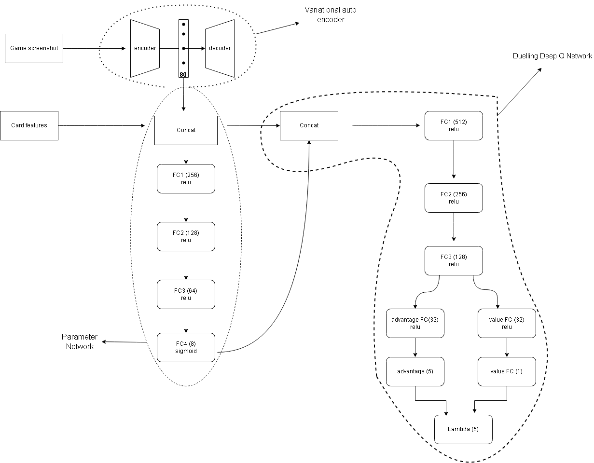

# Description
This project contains my implemenation of reinforcement learning algorithms to attempt to play the game of clash royale. 
Implemented ideas from this paper https://arxiv.org/pdf/1803.10122.pdf and https://arxiv.org/abs/1810.06394
# Agent Overview
action space: 
**card choice**: Discrete(5) 
 - 0 - NOOP
 - 1 - 4 (corresponding card in hand)
 
**position**: game screen boundary

Observation space:

 - **Latent features**: shape of z_dimension of vae
 - **card features**: current shape = 166, changes as development continues

# Methodology

Card features include:

 - current time
 - current elixir
 - current princess towers hitpoints and damage per second
 - 2x elixir (bool)
 - XY positions of enemy troops on the board (max of 50)
 Then for each card in hand and next; 
 - card type (categorical, Troop | Spell)
 - damage per second
 - hitpoints
 - hitspeed
 - targets (categorical, Air | Ground | Air & Ground | Building)
 - speed (categorical, Slow | Medium | Fast | Very fast)
 - range (mixed but treated as categorical)
 - count
 - crown tower damage
 - area damage
 - radius
 - elixir cost
# References

 - https://github.com/davidADSP/GDL_code
 - https://github.com/lollcat/RL-Process-Design
 - https://arxiv.org/abs/1511.06581
 - https://arxiv.org/pdf/1803.10122.pdf
 - https://arxiv.org/abs/1810.06394
